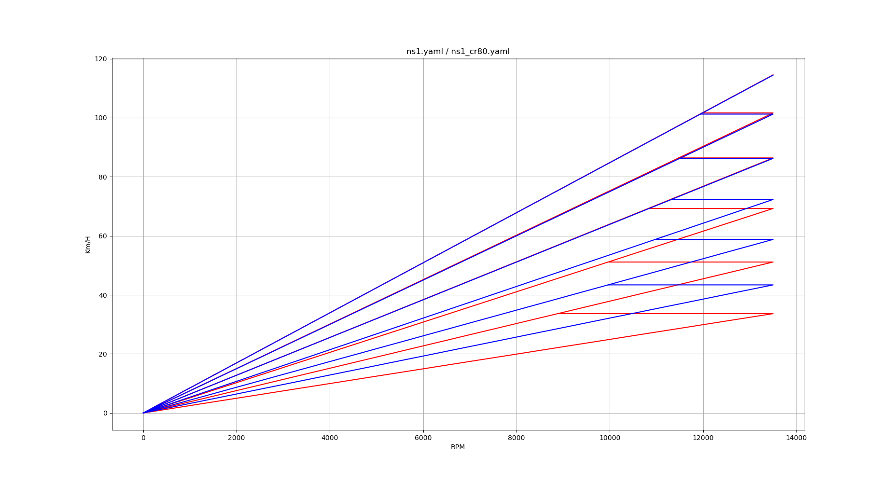

# geardata
Python3 Programm zur Berechnung / Darstellung von Gangdiagrammen für Motorräder, analog des bekannten geardata.  
Anders als dort können hier jedoch zwei komplette Diagramme übereinander gelegt und somit einfacher verglichen werden.  
Ebenso wird der Drehzahlabfall beim Hochschalten angezeigt.  
Die Eingabedaten (Parameter) sind in yaml Files gespeichert, 2 Beispiele sind hier angefügt, eigentlich selbsterklärend.  
Momentan ist es ein einfaches Kommandozeilen-Programm mit 1 oder 2 Parameter-Files als Argument(e)  
Die einzige Nonstandard-Python Library die benötigt wird ist aktuell matplotlib  
ggf. folgt hier auch noch eine GUI Version auf Basis von PyQt5... (wobei jeder der einen Editor bedienen kann, hier sehr schnell verschiedene Setups vergleichen kann).  

## Hinweis für Windows (10) Anwender
Rein interessehalber habe ich das auch mal probiert.  
Hier sind die notwendigen Schritte:

1. Python 3.x installieren (aus App-Store oder via Download von python.org)
2. Bei der Installation sicherstellen dass python in PATH aufgenommen wird
3. matplotlib via pip installieren (in Powershell oder CMD: pip install matplotlib)
4. pyyaml installieren (pip install pyyaml)
